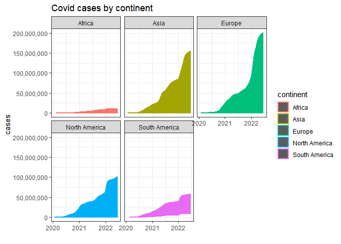
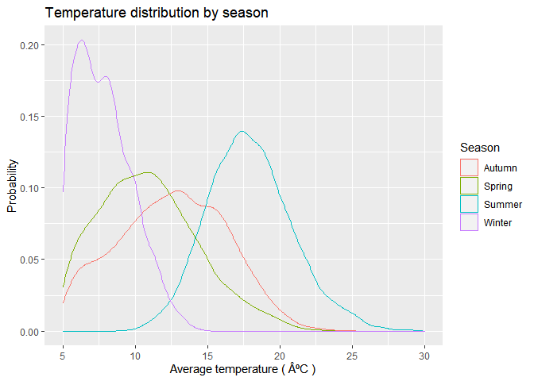

# Purpose

### Getting Started

The following code is to create a structured workflow directory as
required.

``` r
CHOSEN_LOCATION <- "C:/Users/tianc/Rproj/"
fmxdat::make_project(FilePath = glue::glue("{CHOSEN_LOCATION}"), 
                     ProjNam = "19025831")

Texevier::create_template(directory = glue::glue("C:/Users/tianc/Rproj/19025831/"), template_name = "Question1", open_project = F)
Texevier::create_template(directory = glue::glue("C:/Users/tianc/Rproj/19025831/"), template_name = "Question2", open_project = F)
Texevier::create_template(directory = glue::glue("C:/Users/tianc/Rproj/19025831/"), template_name = "Question3", open_project = F)
```

# Question 1 Solution

## Code used for Figures and Tables

``` r
gc() # garbage collection 
```

    ##          used (Mb) gc trigger (Mb) max used (Mb)
    ## Ncells 458171 24.5     987137 52.8   643845 34.4
    ## Vcells 822341  6.3    8388608 64.0  1649542 12.6

``` r
#Loading packages

library(pacman)
p_load(tidyverse, lubridate)

# Here I source in all my functions:

list.files('Question1/code/', full.names = T, recursive = T) %>% as.list() %>% walk(~source(.))

## Data Import

df_owid <- read_csv(glue::glue("Question1/data/Covid/owid-covid-data.csv"))
```

    ## Rows: 194260 Columns: 67
    ## -- Column specification --------------------------------------------------------
    ## Delimiter: ","
    ## chr   (4): iso_code, continent, location, tests_units
    ## dbl  (62): total_cases, new_cases, new_cases_smoothed, total_deaths, new_dea...
    ## date  (1): date
    ## 
    ## i Use `spec()` to retrieve the full column specification for this data.
    ## i Specify the column types or set `show_col_types = FALSE` to quiet this message.

``` r
Continent_list <- c("Europe","North America","South America", "Asia","Africa")
df_owid_adj <- df_owid |> filter(continent %in% Continent_list)

df_death_by_cause <- read_csv(glue::glue("Question1/data/Covid/Deaths_by_cause.csv")) #see if there is a cleaner way
```

    ## Rows: 7273 Columns: 36
    ## -- Column specification --------------------------------------------------------
    ## Delimiter: ","
    ## chr  (3): Entity, Code, Number of executions (Amnesty International)
    ## dbl (33): Year, Deaths - Meningitis - Sex: Both - Age: All Ages (Number), De...
    ## 
    ## i Use `spec()` to retrieve the full column specification for this data.
    ## i Specify the column types or set `show_col_types = FALSE` to quiet this message.

``` r
df_description <- read_csv("Question1/data/Covid/covid_data_description.csv")
```

    ## Rows: 67 Columns: 4
    ## -- Column specification --------------------------------------------------------
    ## Delimiter: ","
    ## chr (4): column, source, category, description
    ## 
    ## i Use `spec()` to retrieve the full column specification for this data.
    ## i Specify the column types or set `show_col_types = FALSE` to quiet this message.

``` r
plot1 <- cases_per_region(df_owid_adj,xaxis_size = 5, xaxis_rows = 3)
```

    ## 
    ## Attaching package: 'scales'

    ## The following object is masked from 'package:purrr':
    ## 
    ##     discard

    ## The following object is masked from 'package:readr':
    ## 
    ##     col_factor

``` r
plot1
```

    ## Warning: Removed 4649 rows containing missing values (position_stack).



``` r
plot2 <- deaths_per_region(df_owid_adj,xaxis_size = 5, xaxis_rows = 3)

plot2
```

    ## Warning: Removed 18626 rows containing missing values (position_stack).


# Question 2 solutions

``` r
#Loading packages

library(pacman)
p_load(tidyverse, lubridate)

# Here I source in all my functions:

list.files('Question1/code/', full.names = T, recursive = T) %>% as.list() %>% walk(~source(.))
list.files('Question2/code/', full.names = T, recursive = T) %>% as.list() %>% walk(~source(.))

# Data

df_weather <- read_csv("Question2/data/London/london_weather.csv", col_types = cols(date = col_date(format = "%Y%m%d")))
```

``` r
g1 <- average_temp_plot(df_weather)

g1
```

    ## `geom_smooth()` using method = 'gam' and formula 'y ~ s(x, bs = "cs")'

    ## Warning: Removed 40 rows containing non-finite values (stat_smooth).

    ## Warning: Removed 40 rows containing missing values (geom_point).


``` r
g2 <- Distribution_ave_temp(df_weather, limits = c(-5,30))

g2
```

    ## Warning: Removed 2163 rows containing non-finite values (stat_density).



``` r
g3 <- violin_plot(df_weather)

g3
```

    ## Warning: Removed 36 rows containing non-finite values (stat_ydensity).

    ## Warning: Removed 36 rows containing missing values (geom_point).


# Question 3 solutions

``` r
#Loading packages

library(pacman)
p_load(tidyverse, lubridate)

# Here I source in all my functions:

list.files('Question1/code/', full.names = T, recursive = T) %>% as.list() %>% walk(~source(.))
list.files('Question3/code/', full.names = T, recursive = T) %>% as.list() %>% walk(~source(.))
```
