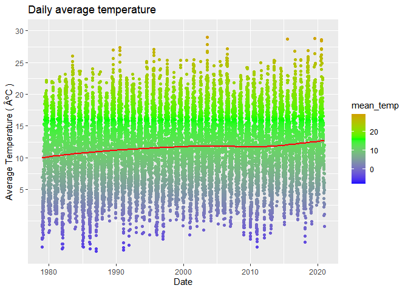
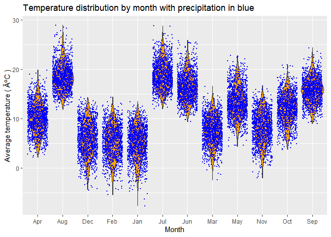

# Purpose

This project is the final practical exam for Data Science 871 in which I
am required to showcase my understanding and ability of the functional
programming paradigm throughout.

### Getting Started

The following code is to create a structured workflow directory as
required.

``` r
CHOSEN_LOCATION <- "C:/Users/tianc/Rproj/"
fmxdat::make_project(FilePath = glue::glue("{CHOSEN_LOCATION}"), 
                     ProjNam = "19025831")

Texevier::create_template(directory = glue::glue("C:/Users/tianc/Rproj/19025831/"), template_name = "Question1", open_project = F)
Texevier::create_template(directory = glue::glue("C:/Users/tianc/Rproj/19025831/"), template_name = "Question2", open_project = F)
Texevier::create_template(directory = glue::glue("C:/Users/tianc/Rproj/19025831/"), template_name = "Question3", open_project = F)
```

# Question 1 Solution

The Covid-19 pandemic has wreaked havoc on many facets of our lives, and
continue to affect travel, work and how people socially interact. For
this question, I visually investigate how different regions globally
experienced the pandemic, specifically with reference to the African
continent.

## Code used for Figures and Tables

``` r
gc() # garbage collection 
```

    ##          used (Mb) gc trigger (Mb) max used (Mb)
    ## Ncells 458205 24.5     987234 52.8   643845 34.4
    ## Vcells 823255  6.3    8388608 64.0  1649542 12.6

``` r
#Loading packages

library(pacman)
p_load(tidyverse, lubridate)

# Here I source in all my functions:

list.files('Question1/code/', full.names = T, recursive = T) %>% as.list() %>% walk(~source(.))

## Data Import

df_owid <- read_csv(glue::glue("Question1/data/Covid/owid-covid-data.csv"))
Continent_list <- c("Europe","North America","South America", "Asia","Africa")
df_owid_adj <- df_owid |> filter(continent %in% Continent_list)

df_death_by_cause <- read_csv(glue::glue("Question1/data/Covid/Deaths_by_cause.csv")) 
df_description <- read_csv("Question1/data/Covid/covid_data_description.csv")
```

The figure below shows the evolution of total positive COVID cases for
each continent. Evidently, Africa has significantly less total reported
cases than the other continents, with Europe and Asia accounting for the
majority. However, a lower level of reported cases in third-world
continents is most likely a result of a lack of testing, and can
possibly explain why South America also reports such relatively low
cases.

``` r
plot1 <- cases_per_region(df_owid_adj,xaxis_size = 5, xaxis_rows = 3)

plot1
```


The next figure is similar to above but displays total deaths recorded.
Interestingly, even though South America has low levels of cases, the
continent displays similar death rates to the of North America and Asia.
On the other hand, Africa displays significantly lower deaths than its
counterparts.

``` r
plot2 <- deaths_per_region(df_owid_adj,xaxis_size = 5, xaxis_rows = 3)

plot2
```


One might prematurely assume that the total vaccinations administered in
each continent can explain these skewed observations, however, the
figure below paints a different picture. At least visually, it seems
unlikely that vaccinations account for the widely different experiences
between continents, especially between the developed and developing
world.

``` r
plot3 <- vaccinations_per_region(df_owid_adj,xaxis_size = 5, xaxis_rows = 3)

plot3
```


# Question 2 solutions

In this question I attempt to disprove a friend’s understanding,
contrary to popular belief, that London has good weather that is mostly
sunny and not at all cold or rainy.

``` r
#Loading packages

library(pacman)
p_load(tidyverse, lubridate)

# Here I source in all my functions:

list.files('Question1/code/', full.names = T, recursive = T) %>% as.list() %>% walk(~source(.))
list.files('Question2/code/', full.names = T, recursive = T) %>% as.list() %>% walk(~source(.))

# Data

df_weather <- read_csv("Question2/data/London/london_weather.csv", col_types = cols(date = col_date(format = "%Y%m%d")))
```

I first produce the figure below, showcasing the distribution of daily
temperatures in London and its average (the red line) from the 1970’s
through 2020. Notice that the average temperature in the past 40 years
hovers around twelve degrees Celsius, with maximum temperature levels
vary rarely exceeding 25 degrees. First conclusion: LONDON IS COLD.

``` r
g1 <- average_temp_plot(df_weather)

g1
```



Secondly, I illustrate in the plot below the distribution of the average
London temperature by each season for the last 40 years. Even though
Summer temperatures appear pleasant, this pleasantness is diminished by
the towering winter distribution, that is heavily skewed towards low
temperatures. Moreover, the lowish average temperatures in the Spring
and Autumn doesn’t exactly invite you to wear short trousers. Therefore,
at least to me, this reaffirms the common belief that it is cold at
least three quarters of the year in London.

``` r
g2 <- Distribution_ave_temp(df_weather, limits = c(-5,30))

g2
```


My friend also, rather incorrectly, stated that London weather is not
rainy. Well, the plot below provides the temperature distribution for
each month, scattered by the blue dots representing precipitation. It is
significantly evident that IT RAINS EVERY MONTH of the year in London.
Thereby, completely debunking my friends belief.

``` r
g3 <- violin_plot(df_weather)

g3
```



# Question 3 solutions

``` r
#Loading packages

library(pacman)
p_load(tidyverse, lubridate)

# Here I source in all my functions:

list.files('Question1/code/', full.names = T, recursive = T) %>% as.list() %>% walk(~source(.))
list.files('Question3/code/', full.names = T, recursive = T) %>% as.list() %>% walk(~source(.))
```
